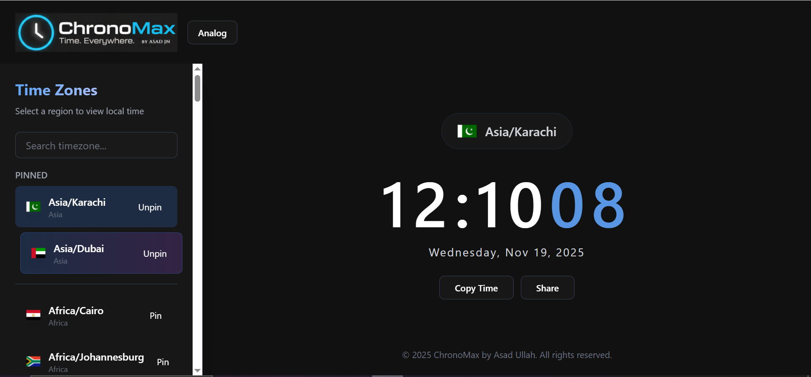

ChronoMax 🌏🕐
ChronoMax is a sleek world clock app that lets you track time across 70+ global cities in real-time. It offers both digital and analog views and lets you pin your favorite timezones—perfect for remote teams, travelers, or anyone managing schedules across timezones.

Features:
🕐 Digital & Analog view
📌 Pin favorite timezones
🌍 70+ cities supported
🎨 Modern, responsive design using Tailwind CSS
💻 Lightweight and fast, built with vanilla JavaScript

Demo:
Include a screenshot or GIF here to show your app in action. Example:

Tech Stack:
HTML5
CSS3
JavaScript
Tailwind CSS

Installation / Usage:
Clone the repository:
git clone https://github.com/your-username/chrono-max.git
Open index.html in your browser
Enjoy tracking global time!

Contribution:
Feel free to fork the repo and submit pull requests.
For major changes, please open an issue first to discuss what you would like to change.

License
This project is licensed under the MIT License.
See the LICENSE file for details.

Contact
Created by Asad Ullah – asadjn99.netlify.app | linkedin.com/in/asad-jn99

“Why I built this”
I built ChronoMax to help remote teams and travelers easily track time around the world, with a clean, modern interface that’s fun to use.
